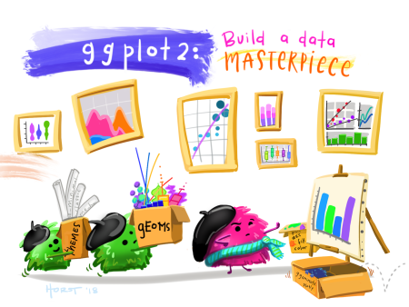

## Q1: Who has never used R? 


## Q2: Who mainly uses R for ggplot2? 




## Q3: Who is left?


## Why R?


## What is an R package?

"In R, the fundamental unit of shareable code is the package. A package bundles together code, data, documentation, and tests, and is easy to share with others." (Wickham, 2015)


## Motivation

>- High demand for 'pieces of script' 
>- Convinced it can make life easier for researchers
>- Similar efforts by other model teams, e.g. various MagPIE packages
>- Keen to learn how to build an R package


## Purpose of rglobiom (for discussion)

>- Provide functions to facilitate GLOBIOM pre/post processing tasks
>- Provide documentation and examples on how to do this
>- Offer a central location for GLOBIOM related info that is nowhere to be found (e.g. list of SIMUs, fm/dm conversion factors, standard crop names, etc)
>- ...?


## Package contents


## Comparing historical trends and projections


## EU NUTS map

```{r echo=FALSE, warning=FALSE, include = FALSE}
library(rglobiom)
library(ggplot2)
library(sf)
library(dplyr)

# Load the EU NUTS polygons
eu_nuts_poly <- st_read(system.file("shp", "NUTS2_revised.shp", package = "rglobiom"))

# Load the test data from the into the global R environment (i.e. it will display in RStudio so you can see it)
data("eu_nuts_pdf", package="rglobiom")

# Join the data. The variable names in the polygon file and the data file are the same (NUTS2) so they are automatically linked. Note that the order is important because otherwise the polygon format will be lost.
eu_nuts <- left_join(eu_nuts_poly, eu_nuts_pdf)

# Prepare data. We select only the year 2050 and the BASE scenario.
# We remove NA values, if any.
df <- eu_nuts %>%
  filter(year == 2050, scenario == "BASE", !is.na(value))
```

```{r echo=FALSE, warning=FALSE}

# # Create the map. Note that we plot the map twice (2xgeom_sf). The first call ensures that the full map is depicted (with background color white). As we used a filter, it is possible we removed polygons for which data was not available, which would otherwise be dropped.
# ggplot() +
#   geom_sf(data = eu_nuts_poly, colour = "grey30", fill = "white") +
#   geom_sf(data = df, colour = "grey30", aes(fill = value)) +
#   scale_fill_gradientn(colours = terrain.colors(10)) +
#   labs(fill = "", x = "", y = "", title = "PDF of global species for BASE scenario, 2050") +
#   theme(panel.grid.major = element_blank(), 
#         panel.grid.minor = element_blank(), 
#         panel.background = element_blank(),
#         panel.border = element_rect(colour = "black", fill = "transparent"), 
#        plot.title = element_text(hjust = 0.5))

# Create bins
interval <- c(0, 1.5, 3, 6, 9, 12, 15, 20, 30, 60, 100, 110)

# Create legend labels
lab <- paste(interval, interval[-1], sep = " - ")[c(1:11)]

# As the palette has only 9 colors and we need 12, we need to interpolate additional colors.
library(RColorBrewer)
n_col = length(interval)
getPalette = colorRampPalette(brewer.pal(9, "YlOrBr"))

# Add the binned data
df <- df %>%
  mutate(value2 = cut(value, interval, include.lowest = T))

# Create the map
ggplot() +
  geom_sf(data = eu_nuts_poly, colour = "grey30", fill = "transparent") +
  geom_sf(data = df, colour = "grey30", aes(fill = value2)) +
  scale_fill_manual(values = getPalette(n_col), labels = lab) +
  labs(x = "", y = "", fill = "PDF/ha" , title = "EU nuts abandoned land for 2050") +
  theme(panel.grid.major = element_blank(), 
        panel.grid.minor = element_blank(), 
        panel.background = element_blank(),
        panel.border = element_rect(colour = "black", fill = "transparent"), 
        plot.title = element_text(hjust = 0.5),
        legend.position = c(0.9, 0.65),
        legend.background = element_rect(fill = "transparent")) 

```


## GLOBIOM 30 region map

```{r message=FALSE, warning=FALSE, include=FALSE}
library(rglobiom)
library(ggplot2)
library(sf)
library(dplyr)

# Load the world map
world_poly <- st_read(system.file("shp", "region30.shp", package = "rglobiom"))

# We remove antartica
world_poly <- world_poly %>%
  filter(iso3c != "ATA")

# As the palette has only 9 colors and we need 30, we need to interpolate additional colors.
library(RColorBrewer)
n_col = length(unique(world_poly$ANYREGION))
getPalette = colorRampPalette(brewer.pal(12, "Paired"))
```

```{r echo=FALSE, warning=FALSE}
# Create the world map showing the GLOBIOM regions.
# We add a grey background map that will show polygons not included in ANYREGION.
ggplot() +
  geom_sf(data = world_poly, colour = "grey30", fill = "grey80") +
  geom_sf(data = filter(world_poly, !is.na(ANYREGION)), aes(fill = ANYREGION)) +
  theme_void() +
  theme(legend.position = "bottom") +
  labs(fill = NULL) +
  scale_fill_manual(values = getPalette(n_col))
```


## LUID map


## How does it work?

[Link](https://iiasa.github.io/rglobiom/index.html)


## Need to decide on:

>- Fixed location of base maps
>- Fixed location of OUTPUT_FAO.gdx
>- Standard GLOBIOM nomenclature
>- Limited number of scenario columns


## Maintenance and updates

>- Project in the IIASA Github repository
>- Relatively easy to add functionalities and generate documentation


## Next steps?

>- Please try and provide feedback
>- Is there anything else that should be added?


## Thank you


<small>source: https://blog.revolutionanalytics.com/2017/05/tweenr.html </small>


